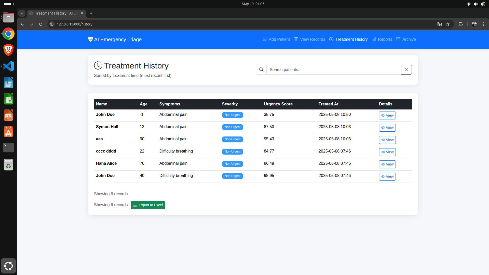

# 🏥 Emergency Triage System for Pandemics and Disasters

This project is a machine learning-based triage system designed to prioritize patients during emergencies such as pandemics and disasters. The system classifies patients into 5 emergency levels (based on the **Canadian Triage and Acuity Scale - CTAS**) and assigns a score to help medical professionals make better-informed decisions.

---

## 🚀 Project Overview

- **Input**: Unlabeled dataset of patients with features such as age, sex, hypertension, Glasgow score, SO2, heart rate, etc.
- **Goal**: Automatically classify patients into CTAS levels and assign an emergency score (1–99) within each class.
- **Output**: A web-based platform to manage patient intake, classification, treatment history, and real-time reporting.

---

## 🧠 Machine Learning Pipeline

### 🔹 1. **Clustering & Labeling**
- Performed clustering on the unlabeled dataset using multiple algorithms.
- **KMeans** provided the best performance and was used to cluster patients into 5 groups.
- Based on **Power BI** visualizations and CTAS guidelines, each cluster was mapped to a CTAS level.

### 🔹 2. **Emergency Score Assignment**
- Used `ExtraTreesRegressor` to rank feature importance.
- Assigned emergency scores (1–99) within each CTAS class based on weighted attributes.

### 🔹 3. **Classification Model**
- Built an **ensemble model** (Soft Voting between SVM, KNN, Decision Tree).
- Achieved **93% accuracy** in classifying patients into CTAS levels.

### 🔹 4. **Regression Model**
- Trained **Gradient Boosting Regressors** (one per CTAS class) to predict the emergency score of a patient.

---

## 🖥️ Web Platform Features

### 🔸 Page 1: Add New Patient
- Enter patient details.
- Automatically classify the patient and assign an emergency score.

### 🔸 Page 2: Patient Queue
- Displays all patients sorted by CTAS level, then by score.
- Allows validation by doctors to send patients to the treatment page.

### 🔸 Page 3: Treatment History
- View treatment history.
- Export patient records for long-term data collection.

### 🔸 Page 4: Reports
- Real-time statistics on:
  - Total patients
  - Number per CTAS level
  - Queue distribution

### 🔸 Page 5: Archive
- Stores all exported patient data.
- Enables dataset augmentation for future model retraining.

---

## 📊 Visuals

| Add Patient | Patient Queue | Treatment History |
|-------------|---------------|-------------------|
|  |  |  |

| Reports | Archive | Patient Record |
|--------|---------|----------------|
|  |  |  |

---

## 🛠️ Technologies Used

- **Python** (Scikit-learn, Pandas, NumPy)
- **Power BI** (for data visualization and cluster analysis)
- **Flask** (Web backend)
- **HTML/CSS/JS** (Frontend)
- **Bootstrap** (UI framework)

---

## ♻️ Data Feedback Loop

- Exported and validated patient data can be used to **augment the initial dataset**.
- Retraining the models improves accuracy and adapts the system over time.

---

## 📬 Contact

Feel free to reach out if you'd like to collaborate, contribute, or ask questions!

- GitHub: [AbdeldjalilHANI](https://github.com/your-username)
- Email: abdeldjalilhani0@gmail.com

---

## 📄 License

This project is open source and available under the [MIT License](LICENSE).

